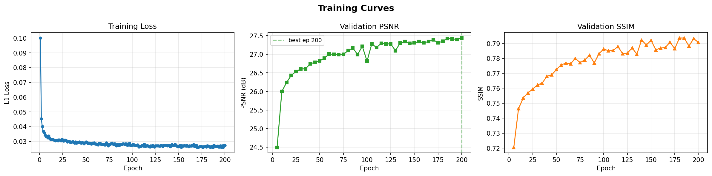
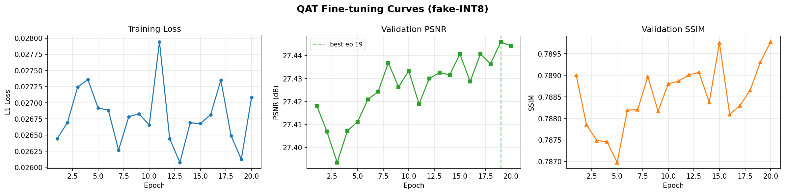
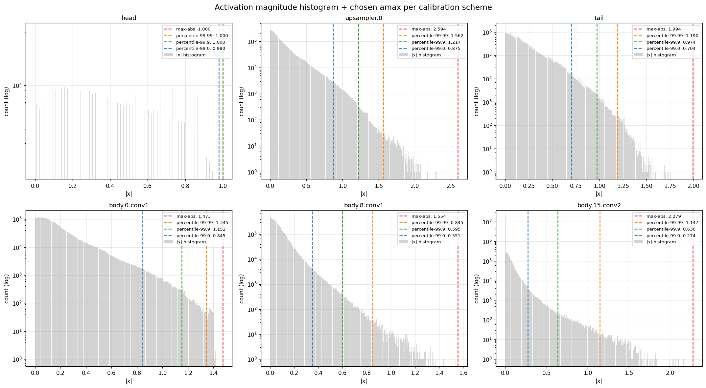
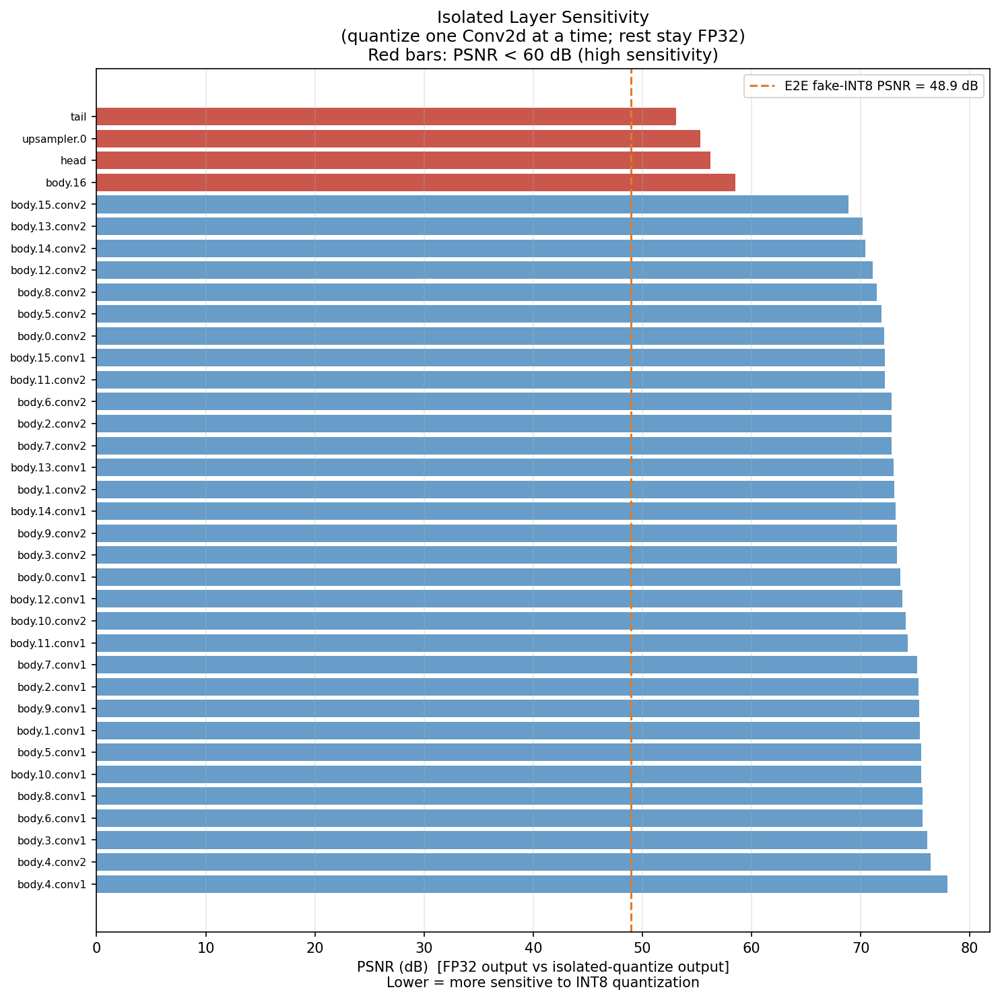
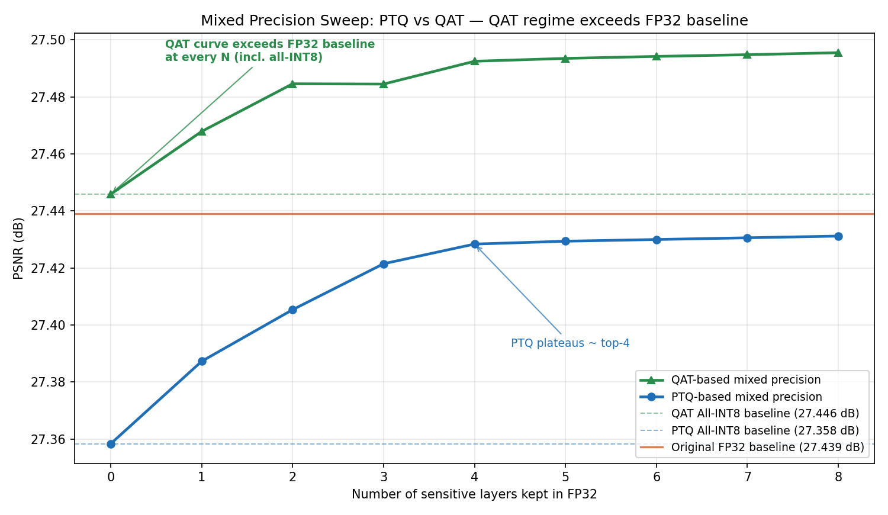
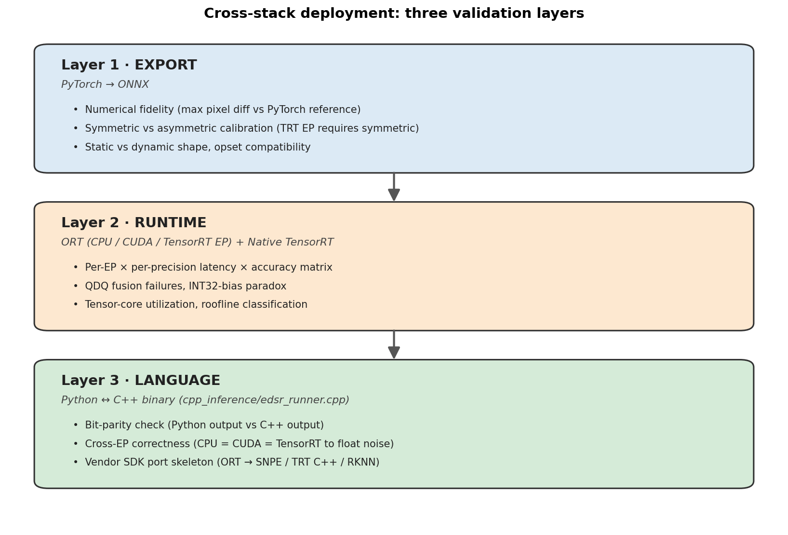
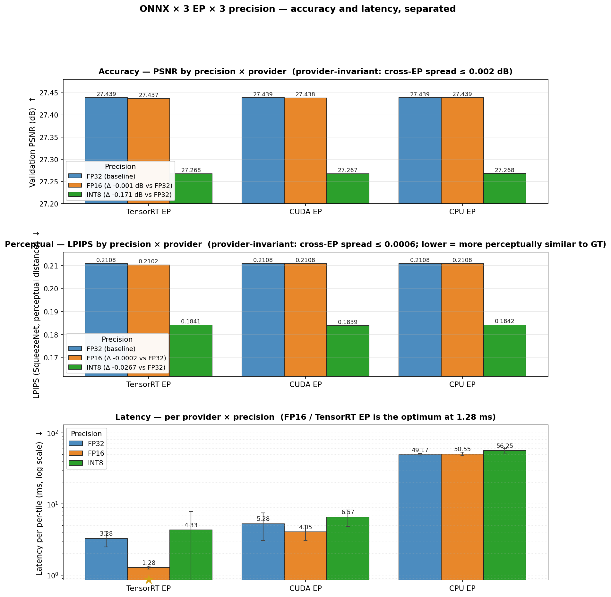
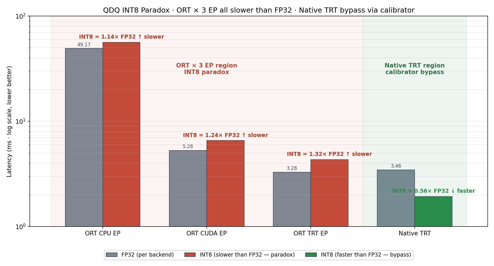
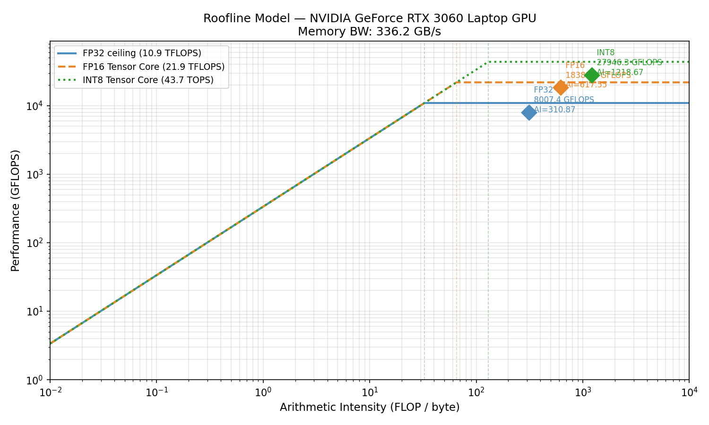
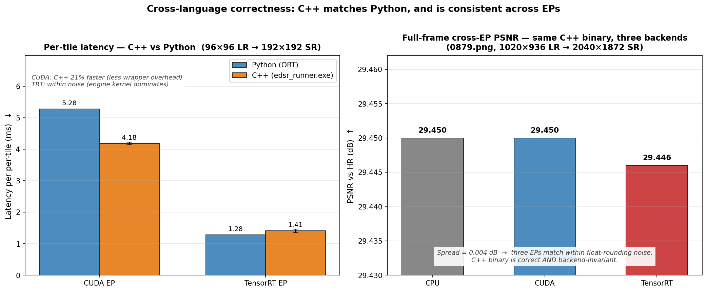

# RealSR-Quant

A pre-handoff quantization analysis & optimization pipeline for super-resolution. EDSR-baseline is used as the substrate; the deliverable is a decision package (recipes + reasoning + scope boundary) that lets a downstream NPU/SoC team adapt the work to their silicon, not a single tuned config. All measurements are on a workstation GPU (RTX 3090) and ONNX/TRT — real edge-device verification is explicitly out of scope and marked as such throughout.

The project is structured as four investigation tracks layered on a single trained model:

1. **Model training** — EDSR-baseline on DIV2K with realistic degradation (this section)
2. **Quantization recipes** — PTQ vs QAT, calibration ablation, per-layer sensitivity, mixed-precision sweep
3. **Cross-stack deployment** — ONNX × 3 EP (CPU / CUDA / TensorRT), Native TRT, C++ ORT runner, roofline analysis
4. **Findings & scope** — QDQ paradox, perceptual triangulation (PSNR/SSIM/LPIPS), HW utilization, honest verified / hypothesized / cannot-verify boundary

This README currently covers sections 1, 2, and 3; section 4 will be added incrementally.

---

## 1. Model Training

### 1.1 Setup

| Item | Value |
|---|---|
| Backbone | EDSR-baseline ([Lim et al., CVPRW 2017](https://arxiv.org/abs/1707.02921)) |
| Residual blocks × feature width | 16 × 64 |
| Upsample scale | ×2 |
| Parameters | ~1.37 M |
| Loss | L1 (rationale in [docs/adr/004_loss_function_choice.md](docs/adr/004_loss_function_choice.md)) |
| Optimizer | Adam, lr = 1e-4 |
| LR schedule | StepLR, step = 100 epochs, γ = 0.5 |
| Epochs | 200 |
| Batch / patch (LR) | 16 / 96 (HR patch = 192) |
| Dataset | DIV2K — 800 train HR / 100 val HR |
| Degradation | Realistic — Gaussian blur (σ 0.1–2.0) → bicubic ↓×2 → AWGN (σ 0–25) → JPEG (Q 60–95) → optional banding (4–6 bit) |
| Hardware | Single RTX 3090 24GB, ~3–4 GB VRAM at this config |
| Framework | PyTorch 2.x, optional `torch.compile` |

The realistic degradation pipeline is intentionally TV-content-leaning rather than the academic bicubic-only setup; details and per-step parameter ranges are in [src/data/degradation.py](src/data/degradation.py).

### 1.2 Reproduce

```bash
# Default Track B: realistic degradation, 200 epochs, batch 16
python -m src.training.train --compile --compile-mode default

# Quick smoke test (2 epochs, batch 2) — verifies the loop end-to-end
python -m src.training.train --quick

# Resume from a checkpoint
python -m src.training.train --resume results/runs/<run_id>/checkpoints/best.pt
```

Each run writes a timestamped folder under `results/runs/`:

```
results/runs/<YYYYMMDD_HHMMSS>_ep200_b16_scale2_realistic/
├── checkpoints/         # best.pt, periodic epoch_NNN.pt, final.pt
├── val_samples/         # LR | Bicubic | SR | HR comparison panels
├── metrics.csv          # epoch, train_loss, val_psnr_db, val_ssim
└── curves.png           # loss / PSNR / SSIM curves
```

### 1.3 Training Curve



Source: [results/runs/20260427_143542_ep200_b16_scale2_realistic/curves.png](results/runs/20260427_143542_ep200_b16_scale2_realistic/curves.png) — full per-epoch metrics in [metrics.csv](results/runs/20260427_143542_ep200_b16_scale2_realistic/metrics.csv).

### 1.4 Result

| Checkpoint | Val PSNR (dB) | Val SSIM |
|---|---|---|
| Bicubic baseline (val set) | ~25.6 | ~0.72 |
| EDSR-baseline FP32, epoch 200 | **27.44** | **0.7907** |

PSNR plateaus around epoch 150 with a long, low-amplitude tail to epoch 200; the StepLR drop at epoch 100 is visible as a tightening in the loss curve. The model is deliberately *just-strong-enough* — it is the substrate for downstream quantization stress, not a SOTA SR submission. Choosing a higher-capacity backbone would have made the INT8 / mixed-precision findings less informative because there would be more headroom to absorb quantization noise.

### 1.5 Key Scripts

| File | Role |
|---|---|
| [src/training/train.py](src/training/train.py) | Training entry point — argparse config, FP32 loop, validation, checkpointing, optional QAT phase |
| [src/data/dataset.py](src/data/dataset.py) | `SRDataset` — DIV2K HR loader with on-the-fly LR generation |
| [src/data/degradation.py](src/data/degradation.py) | `RealisticDegradation` — composable blur / noise / JPEG / banding / down-sample |
| [src/models/edsr.py](src/models/edsr.py) | EDSR-baseline model definition |
| [src/models/common.py](src/models/common.py) | Shared building blocks (residual block, upsampler) |
| [docs/adr/004_loss_function_choice.md](docs/adr/004_loss_function_choice.md) | Loss-function ADR — why L1 over L2 / Charbonnier / perceptual |

QAT fine-tuning is implemented in the same `train.py` (`--qat` flag, calibration → STE fine-tune → fake-INT8 best checkpoint) and is covered in section 2.

---

## 2. Optimization Recipes

### 2.1 Framing — decision support, not method demo

The output of this section is **not** "I implemented N quantization methods." It is a **decision package** for a downstream NPU/SoC team:

- **Recipe** — concrete configuration to try first (e.g. *max-abs calibration, top-2 layers in FP32, optional QAT 20-epoch fine-tune*)
- **Reasoning** — the trade-off behind each choice and the measured number that supports it
- **Boundary** — what the decision *doesn't* cover (verified vs hypothesized vs out-of-scope)

Five orthogonal recipes are explored, each backed by a measurement artifact in `results/`:

| § | Recipe axis | Question it answers |
|---|---|---|
| 2.2 | **Format shootout** | What does each precision option (FP32 / FP16 / BF16 / INT8 PTQ / INT8 QAT) cost on PSNR, SSIM, LPIPS, and on-disk size? |
| 2.3 | **QAT fine-tuning** | The training-time recipe behind the INT8 QAT row in §2.2 — schedule, why the conservative 20ep / lr=1e-5 default? |
| 2.4 | **Calibration method** | Within INT8 PTQ, which calibration scheme is the safe default? |
| 2.5 | **Per-layer sensitivity** | Which layers actually pay the INT8 quantization tax? |
| 2.6 | **Mixed precision** | If we keep top-N sensitive layers in FP32, how much PSNR comes back, and where is the knee? |

### 2.2 Format shootout — FP32 / FP16 / BF16 / INT8 PTQ / INT8 QAT

A single table puts every precision option on the same val set, with the same metric implementations, so rows are directly comparable.

**Result** (on DIV2K val, 100 images, EDSR-baseline 200ep). Header arrows: **↑** higher is better, **↓** lower is better. ΔPSNR is signed vs FP32 baseline (positive = beats baseline). PSNR/SSIM measure fidelity to ground truth; LPIPS measures perceptual distance — they don't always agree (see [learning/int8_perception_finding.md](learning/int8_perception_finding.md) for the caveat).

| Format | PSNR (dB) ↑ | ΔPSNR ↑ | SSIM ↑ | LPIPS ↓ | Size (MB) ↓ |
|---|---|---|---|---|---|
| FP32 (baseline) | 27.439 | — | 0.7907 | 0.2108 | 5.23 |
| FP16 (autocast) | 27.438 | −0.001 | 0.7907 | 0.2108 | 2.61 |
| BF16 (autocast) | 27.422 | −0.017 | 0.7904 | 0.2093 | 2.61 |
| INT8 PTQ (fake-quant) | 27.359 | −0.080 | 0.7863 | 0.1955 | 1.31 |
| FP32 (QAT weights, fake-quant off) | **27.501** | **+0.063** | 0.7932 | 0.2050 | 5.23 |
| INT8 QAT (fake-quant) | 27.446 | **+0.007** | 0.7893 | 0.1900 | 1.31 |

Two non-obvious rows: the **FP32 (QAT weights)** row isolates the *training-time* effect of QAT (better than the original FP32 baseline by +0.063 dB — most likely STE acting as a regularizer rather than pure extra training, since the FP32 model is already near-converged; see §2.3), and **INT8 QAT** lands within noise of the original FP32 baseline at ¼ the size. The LPIPS column drops the cleanest under INT8 — interpreted with magnitude check in [learning/int8_perception_finding.md](learning/int8_perception_finding.md).

**How to reproduce**

```bash
# FP32 / FP16 / BF16 / INT8 PTQ rows (also runs sensitivity in 2.5 unless skipped)
python -m src.quantization.analyze \
    --checkpoint results/runs/<fp32_run>/checkpoints/best.pt \
    --output-dir results/quantization/200ep_with_report

# Append the two QAT rows (FP32-mode + INT8-mode of the QAT checkpoint)
python -m src.quantization.eval_qat \
    --qat-checkpoint  results/runs/<qat_run>/checkpoints/best_qat.pt \
    --fp32-checkpoint results/runs/<fp32_run>/checkpoints/best.pt \
    --shootout-csv results/quantization/200ep_with_report/shootout.csv \
    --shootout-md  results/quantization/200ep_with_report/shootout.md
```

**Scripts** — [src/quantization/analyze.py](src/quantization/analyze.py) (shootout entry; LPIPS via `lpips` SqueezeNet backbone), [src/quantization/eval_qat.py](src/quantization/eval_qat.py) (QAT row appender)
**Outputs** — [results/quantization/200ep_with_report/shootout.md](results/quantization/200ep_with_report/shootout.md) · [shootout.csv](results/quantization/200ep_with_report/shootout.csv)

### 2.3 QAT fine-tuning

Recipe (implemented in [src/training/train.py:404-551](src/training/train.py#L404-L551), `--qat` flag):

1. Load the FP32 `best.pt`.
2. Wrap every `Conv2d` with `CalibratingConv2d` (fake-quant + activation scale buffer).
3. Run a short calibration pass on training data (default 20 batches) to set per-tensor activation `amax`, then freeze scales.
4. Switch to **QAT mode** (fake-quant on, weight gradients via Straight-Through Estimator) and fine-tune.
5. Default schedule — **20 epochs, lr = 1e-5** (10× smaller than base), CosineAnnealingLR. Validation runs in *quantize mode* (clean fake-INT8 measurement, no STE noise leaking into PSNR).

The conservative LR is intentional: the FP32 model is essentially converged, so the fine-tune's main job is to absorb quantization noise rather than continue learning the SR task (the +0.063 dB the §2.2 FP32-eval row picks up is best read as STE-regularization, not pure extra training). Going to 50 epochs / 5e-5 rarely helps in our experiments and risks regression — full reasoning in [learning/when_to_use_qat.md](learning/when_to_use_qat.md).


*20-epoch QAT fine-tune at lr=1e-5, evaluated in fake-INT8 mode. Validation PSNR trends upward from epoch 1 (27.418 dB) to best at ep 19 (**27.446 dB**) — about +0.03 dB across the fine-tune phase, and +0.088 dB total over the PTQ-only INT8 baseline (27.358, §2.2). Training L1 loss is noisy but stays in a tight band — no regression, supporting the conservative schedule over 50ep / 5e-5.*

**How to reproduce**

```bash
# Train FP32 then QAT in one shot
python -m src.training.train --compile --qat

# QAT only (skip FP32 phase) starting from an existing checkpoint
python -m src.training.train --epochs 0 --qat \
    --qat-from results/runs/<fp32_run>/checkpoints/best.pt
```

**Output** — Each QAT run writes a separate `<run>_qat/` directory next to the FP32 run, with `best_qat.pt`, QAT-phase `curves.png`, and `metrics.csv` so the FP32 baseline is preserved untouched.

### 2.4 Calibration ablation — max-abs vs percentile

Within INT8 PTQ, the calibration scheme is the first knob a vendor will turn. This compares four schemes on the same model:


*Per-layer activation magnitude distribution with each scheme's chosen `amax` overlaid (dashed lines). Visual reason for the cliff: percentile-99.0 cuts into the body of the distribution at every layer; max-abs and percentile-99.99 sit at the tail edge.*

| Scheme | PSNR (dB) | ΔPSNR vs FP32 | SSIM | Comment |
|---|---|---|---|---|
| max-abs | 27.364 | −0.075 | 0.7866 | default; preserves outlier weights |
| percentile-99.99 | 27.363 | −0.075 | 0.7887 | matches max-abs PSNR, slightly better SSIM |
| percentile-99.9 | 26.986 | −0.453 | 0.7840 | starts clipping; visibly worse |
| percentile-99.0 | 25.272 | −2.166 | 0.7539 | fully broken |

The PSNR spread between max-abs and percentile-99.99 is < 0.01 dB — **either is a safe default**. Percentile-99.9 is the cliff. → **Vendor input:** default to `max-abs`; if SSIM-leaning, try `percentile-99.99`; do *not* use 99.9 or below as the first attempt.

**How to reproduce**

```bash
python -m src.quantization.calibration_ablation \
    --checkpoint results/runs/<fp32_run>/checkpoints/best.pt \
    --output-dir results/quantization/calibration_ablation
```

**Script** — [src/quantization/calibration_ablation.py](src/quantization/calibration_ablation.py)
**Output** — [results/quantization/calibration_ablation/calibration_ablation.md](results/quantization/calibration_ablation/calibration_ablation.md) · [ablation.csv](results/quantization/calibration_ablation/ablation.csv) · [histograms.png](results/quantization/calibration_ablation/histograms.png)

### 2.5 Per-layer sensitivity

Each of the 36 Conv2d layers is INT8-quantized in isolation while the rest stay FP32. The PSNR drop for that single layer is the layer's *sensitivity score*.

The top of the ranking is concentrated and intuitive: pixel-shuffle / final-projection / first-conv layers hurt the most.


*All 36 Conv2d layers ranked by **output-fidelity PSNR** — FP32 output vs single-layer-INT8 output. Note this is an internal-fidelity metric (large dynamic range, ~48–78 dB) and is distinct from the end-to-end SR PSNR drop in the table below (small dynamic range, < 0.03 dB); the rankings agree. Four red bars (`tail`, `upsampler.0`, `head`, `body.16`) fall below the all-INT8 E2E reference at 48.9 dB; the remaining 32 stay above 65 dB. The spread is the data behind the top-N FP32 strategy in §2.6.*

| Rank | Layer | PSNR drop (dB) when this layer is INT8 alone |
|---|---|---|
| 1 | `tail` | 0.029 |
| 2 | `upsampler.0` | 0.020 |
| 3 | `head` | 0.016 |
| 4 | `body.16` | 0.007 |
| 5+ | `body.*.conv2` (residual blocks) | < 0.001 each |

→ The body of the network is **highly INT8-tolerant**; the heads/tail/upsampler carry almost all the sensitivity. This is exactly the input the mixed-precision sweep needs.

**How to reproduce** — sensitivity is computed by the same `analyze.py` invocation as 2.2 (skip with `--skip-sensitivity` if not needed).

**Output** — [sensitivity.md](results/quantization/200ep_with_report/sensitivity.md) · [sensitivity.csv](results/quantization/200ep_with_report/sensitivity.csv)

### 2.6 Mixed-precision sweep — PTQ vs QAT

Walk N from 0 to 8: keep the top-N most-sensitive layers (per 2.5) in FP32, INT8 the rest, measure PSNR. Run the sweep twice — once over the PTQ baseline, once over the QAT-trained weights — and overlay.



| N (FP32 layers) | PTQ PSNR | QAT PSNR | QAT − FP32 baseline |
|---|---|---|---|
| 0 (all-INT8) | 27.358 | 27.446 | +0.007 |
| 2 (tail, upsampler.0) | 27.405 | **27.485** | **+0.046** |
| 4 (top-4) | 27.428 | 27.493 | +0.054 |
| 8 (top-8) | 27.431 | 27.496 | +0.057 |

Two takeaways:
- **PTQ knee at N≈4** — past 4 sensitive layers in FP32, returns flatten.
- **QAT path lifts the entire curve above the original FP32 baseline (27.439)** even at N=0 (all-INT8). For a vendor without FP32 fallback support, that's the meaningful win — mixed precision becomes optional rather than mandatory.

**How to reproduce**

```bash
# PTQ sweep (default)
python -m src.deployment.mixed_precision \
    --checkpoint  results/runs/<fp32_run>/checkpoints/best.pt \
    --sensitivity results/quantization/200ep_with_report/sensitivity.csv \
    --output-dir  results/mixed_precision/edsr_200ep

# QAT sweep (loads QAT weights, skips re-calibration)
python -m src.deployment.mixed_precision --qat \
    --checkpoint  results/runs/<qat_run>/checkpoints/best_qat.pt \
    --sensitivity results/quantization/200ep_with_report/sensitivity.csv \
    --output-dir  results/mixed_precision/edsr_200ep_qat

# Overlay both curves with FP32 baseline reference
python -m src.deployment.compare_mixed_precision \
    --ptq-csv results/mixed_precision/edsr_200ep/mixed_precision_sweep.csv \
    --qat-csv results/mixed_precision/edsr_200ep_qat/mixed_precision_sweep.csv \
    --output  results/mixed_precision/ptq_vs_qat_sweep.png \
    --fp32-baseline 27.439
```

**Scripts** — [src/deployment/mixed_precision.py](src/deployment/mixed_precision.py) · [src/deployment/compare_mixed_precision.py](src/deployment/compare_mixed_precision.py)
**Outputs** — [results/mixed_precision/edsr_200ep/](results/mixed_precision/edsr_200ep/) · [results/mixed_precision/edsr_200ep_qat/](results/mixed_precision/edsr_200ep_qat/) · [ptq_vs_qat_sweep.png](results/mixed_precision/ptq_vs_qat_sweep.png)

### 2.7 Decision package — what the vendor receives

| Question | Recipe (this repo's first answer) | Reasoning anchor |
|---|---|---|
| Default INT8 calibration? | `max-abs` | 2.4 — spread vs percentile-99.99 < 0.01 dB |
| First mixed-precision target? | top-2 FP32: `tail` + `upsampler.0` | 2.5/2.6 — 58% of the FP32-vs-INT8 PSNR gap recovered at minimum FP32 footprint; escalate to top-4 (86%) if vendor needs more |
| When to invest in QAT? | If PTQ drop > 0.2 dB *or* vendor has no FP32 fallback | 2.6 — QAT all-INT8 already exceeds original FP32 baseline |
| Acceptable Native FP16 / BF16? | Both: FP16 is identical, BF16 within 0.02 dB | 2.2 — keep as ½-size fallbacks |

Each row is intentionally a **path**, not a final config: the vendor can adapt — re-rank layers on their own data, re-run the sweep against their hardware's mixed-precision support, swap calibration to percentile if their distribution warrants it. Three classes are deliberately *out of scope* (architecture choice, INT4 / mixed-bit, customer-distribution edge cases) and surfaced in section 4 rather than hidden — see [learning/senior_deliverable_framing.md](learning/senior_deliverable_framing.md) for the full rationale.

---

## 3. Cross-stack Deployment

### 3.1 Framing — what cross-stack catches that §2 doesn't

§2's measurements all live inside the PyTorch fake-quant world: same Python process, same FP32 reference, same numerical kernel. Real deployment crosses three boundaries, each of which can silently change behavior:


*Three independent validation layers §3 covers. **Layer 1 (export)** catches "did PyTorch → ONNX preserve numerics?"; **Layer 2 (runtime)** catches "does this ONNX behave the same on each EP / native TRT?"; **Layer 3 (language)** catches "does the C++ binary match Python output bit-for-bit?". Each layer adds an independent class of failure modes that §2 PTQ/QAT analysis cannot expose on its own.*

**Hardware caveat (carried throughout)**: all measurements below are on a consumer Ampere GPU (RTX 3060 Laptop, sm86) with 96×96 LR per-tile input. **Real edge-device verification on TV SoC NPU is out of scope** — the per-precision *fidelity* numbers port across hardware, the absolute *latency* does not. Where the distinction matters, it is called out per section. The full verified / hypothesized / cannot-verify decomposition lands in §3.6.

### 3.2 ONNX × 3 EP shootout — FP32 / FP16 / INT8 across CPU / CUDA / TensorRT EP

A single ONNX export goes into ONNX Runtime with three execution providers. Same model, same val set, three backends → nine cells.


*All three panels share the same 3×3 grouping (x = EP, hue = precision), so they read top-to-bottom against a common axis. **Top — PSNR**: three near-identical bars per precision visualize provider invariance (cross-EP spread ≤ 0.002 dB); INT8 drops 0.171 dB, FP16 vs FP32 is essentially zero. **Middle — LPIPS** (perceptual distance, lower = better): same provider-invariance pattern (cross-EP spread ≤ 0.0006). INT8 drops from 0.211 to 0.184 — a perceptual *gain*, even though PSNR drops. **This confirms §2.2's PyTorch fake-quant finding survives ONNX export** (and the deploy-side INT8 LPIPS 0.184 is even slightly better than fake-quant's 0.196 prediction). **Bottom — per-tile latency** (log scale): ★ marks FP16 / TensorRT EP at 1.28 ms (the optimum on this hardware). INT8 is anomalously slower than FP16 across all three EPs — that anomaly is traced in §3.3.*

**Headline matrix** — latency per per-tile inference (ms ↓, lower is better):

| Precision \ Provider | TensorRT EP | CUDA EP | CPU EP |
|---|---:|---:|---:|
| FP32 | 3.28 ± 0.77 | 5.28 ± 2.23 | 49.17 ± 2.10 |
| FP16 | **1.28 ± 0.06** | 4.05 ± 0.99 | 50.55 ± 2.81 |
| INT8 | 4.33 ± 3.47 | 6.57 ± 1.70 | 56.25 ± 4.43 |

**Accuracy** (provider-invariant within float noise): FP32 **27.439 dB / 0.2108 LPIPS** · FP16 27.438 / 0.2108 · INT8 27.268 / **0.1841** ↓ (INT8 PSNR drops 0.171 dB but LPIPS *improves* by 0.027 — perceptual gain at deploy level).

**Three findings worth surfacing**:

- **FP16 / TensorRT EP is the optimum on this hardware** — 2.6× faster than FP32 / TensorRT EP, with ~zero PSNR cost. Three factors compound: **(1) tensor-core preference** — Ampere tensor cores hit ~2× FP32 throughput in FP16 (FP16 matmul, FP32 accumulate); **(2) graph fusion** — TensorRT EP compiles the conv graph into single tensor-core kernels, while CUDA EP runs op-by-op via cuDNN with no fusion. The numerical fingerprint: TRT EP delivers a 2.56× FP16 speedup (3.28 → 1.28 ms), CUDA EP only 1.30× (5.28 → 4.05 ms) at the same precision — without fusion, kernel-launch overhead absorbs much of the FP16 win; **(3) halved DRAM read** — FP16 weights are half the bytes, a smaller cumulative tailwind on this compute-bound workload. **Evidence**: §3.4 roofline confirms FP16 reaches the highest tensor-core utilization of the three precisions tested — 84% of peak (FP32 73%, INT8 64%).
- **INT8 is slower than FP16 across all three EPs** — including TRT EP (4.33 vs 1.28 ms). That is unexpected for a "4× quantized" model. §3.3 traces the cause to a backend-fusion failure, not a fundamental INT8 limitation.
- **INT8's perceptual gain survives ONNX deploy** — LPIPS drops from 0.211 (FP32) to 0.184 (INT8), a 12.7% perceptual *improvement* despite PSNR dropping 0.17 dB. §2.2's PyTorch fake-quant predicted LPIPS 0.196 for INT8; the ONNX deploy measurement at 0.184 is **better than the fake-quant prediction**, so the perceptual benefit is not a fake-quant simulation artifact — it ports cleanly to actual deployment. The mechanism is the perception-distortion tradeoff — see the dedicated note below.

**Why INT8 wins on LPIPS — the perception-distortion tradeoff**

This is a textbook instance of the [perception-distortion tradeoff (Blau & Michaeli, CVPR 2018)](https://arxiv.org/abs/1711.06077): you cannot simultaneously minimize per-pixel error (PSNR) *and* perceptual distance to ground truth. INT8 quantization happens to land on the perceptual side of that tradeoff. Three factors compound:

1. **EDSR-baseline is trained with L1 loss** → biased toward median pixel predictions → outputs are systematically *too smooth*, lacking the high-frequency texture present in natural images (the well-known SR regression-to-mean problem).
2. **INT8 quantization injects per-pixel noise at deploy time** whose frequency content resembles photographic grain / sensor noise — much closer to natural-image statistics than FP32's smoother output.
3. **LPIPS uses an ImageNet-pretrained SqueezeNet** as its feature backbone; trained on natural photos, that feature space rewards texture statistics close to natural images and penalizes "too clean" outputs.

The same mechanism is what makes GAN-based SR (ESRGAN, Real-ESRGAN, etc.) score better than L1-trained models on LPIPS — those deliberately inject natural-looking noise during training. **INT8 deployment quantization gets a similar boost effectively "for free", without retraining.** Note this means LPIPS rewards INT8 here partly because the FP32 baseline is itself sub-optimal on perceptual quality (a feature of the L1 training objective, not of the architecture); a GAN-trained or perceptual-loss-trained model would already sit lower on LPIPS, and INT8 wouldn't pull as much extra perceptual gain on top.

**Vendor implication** — for TV-product use cases where perceived sharpness matters more than pixel fidelity (common — viewers don't have a reference frame to compare against), **INT8 deploy is not a quality compromise; it can actively improve perceived quality**. The flip side: PSNR-anchored vendor acceptance criteria can *over-penalize* INT8 builds whose perceptual quality is fine. Both metrics should be on the handoff scorecard.

**How to reproduce**

```bash
# Export FP32 / FP16 / INT8 static ONNX from the FP32 checkpoint
python -m src.deployment.export_pipeline \
    --checkpoint results/runs/<fp32_run>/checkpoints/best.pt \
    --output-dir results/onnx_exports/edsr_200ep \
    --data-root  data/DIV2K --val-dir DIV2K_valid_HR

# 3 EP × 3 precision benchmark
python -m src.deployment.benchmark_onnx \
    --onnx-dir   results/onnx_exports/edsr_200ep \
    --output-dir results/onnx_benchmark/edsr_200ep_full \
    --providers  tensorrt cuda cpu \
    --bench-shape 1x3x96x96 \
    --data-root  data/DIV2K --val-dir DIV2K_valid_HR
```

**Scripts** — [src/deployment/export_pipeline.py](src/deployment/export_pipeline.py) · [src/deployment/benchmark_onnx.py](src/deployment/benchmark_onnx.py)
**Outputs** — [benchmark.md](results/onnx_benchmark/edsr_200ep_full/benchmark.md) · [benchmark.csv](results/onnx_benchmark/edsr_200ep_full/benchmark.csv) · aggregated drill-down in [deploy_summary.md](results/onnx_benchmark/edsr_200ep_full/deploy_summary.md)

### 3.3 The ORT TRT EP INT8 paradox + Native TRT rescue

INT8 should be faster than FP16: fewer bits, smaller engine, dedicated INT8 tensor cores on Ampere. The 4.33 ms in §3.2 is anomalous. Root cause: `onnxruntime.quantization.quantize_static` produces QDQ ONNX with `INT32` bias `DequantizeLinear` nodes; TensorRT 10's ONNX parser rejects those, so ORT TRT EP cannot fuse the graph and falls back to a non-fused path (Q/DQ ops on CPU, conv on GPU FP32, with Memcpy nodes between). The "INT8 model" effectively runs as decorated FP32.


*FP32 (gray) vs INT8 (red/green) latency across four backends. **Red region (ORT × 3 EP)**: INT8 is 1.14×–1.32× *slower* than FP32 — the QDQ fusion failure. **Green region (Native TRT)**: INT8 is 0.56× FP32, i.e. 1.8× faster — the calibrator-based path bypasses QDQ entirely.*

**Native TRT rescue path** — bypass QDQ via the TensorRT Python API + `IInt8EntropyCalibrator2` on 64 val patches:

| Path | INT8 latency (ms) | Engine size (MB) | Notes |
|---|---:|---:|---|
| ORT TRT EP (QDQ ONNX) | 4.33 | 1.43 | Fusion failure → effectively FP32 |
| **Native TRT + calibrator** | **1.93 ± 0.07** | 1.63 | Fully fused INT8 kernels — 2.2× rescue |

INT8 still loses to FP16 (1.93 vs 1.50 ms) on this consumer GPU — that is a *hardware* story (§3.4), not a backend bug. The §3.3 takeaway is that **the QDQ failure was a backend-layer issue, not an INT8 capability limitation**. Any vendor SDK with INT8 calibration support (i.e. every NPU SDK) sidesteps it the same way Native TRT does here.

**How to reproduce**

```bash
# Native TRT engine build (FP32 + FP16 + INT8 via calibrator) + benchmark
python -m src.deployment.benchmark_trt \
    --onnx-dir   results/onnx_exports/edsr_200ep \
    --output-dir results/trt_benchmark/edsr_200ep \
    --bench-shape 1x3x96x96 \
    --data-root  data/DIV2K --val-dir DIV2K_valid_HR

# Generate the paradox chart (uses results from §3.2 + §3.3 above)
python -m src.deployment.qdq_paradox_chart \
    --ort-benchmark results/onnx_benchmark/edsr_200ep_full \
    --trt-benchmark results/trt_benchmark/edsr_200ep \
    --output        results/qdq_paradox_chart.png
```

**Scripts** — [src/deployment/benchmark_trt.py](src/deployment/benchmark_trt.py) · [src/deployment/qdq_paradox_chart.py](src/deployment/qdq_paradox_chart.py)
**Outputs** — [trt_benchmark/edsr_200ep/benchmark.md](results/trt_benchmark/edsr_200ep/benchmark.md) · [qdq_paradox_chart.png](results/qdq_paradox_chart.png) · drill-down in [deploy_summary.md §5b](results/onnx_benchmark/edsr_200ep_full/deploy_summary.md)

### 3.4 Roofline + tensor-core utilization

Why does FP16 still beat INT8 even on Native TRT? `profile_trt.py` builds each TRT engine, runs `torch.profiler` (CUDA activity), and computes achieved TFLOPS against the RTX 3060 Laptop's peak FP32 / FP16 / INT8 ceilings.


*Each precision plotted against arithmetic-intensity peak ceilings. All three points sit far above the memory-bandwidth-limited diagonal — the model + this input shape is **strongly compute-bound** on this GPU.*

| Precision | Achieved (TFLOPS) | Peak (TFLOPS) | Utilization | Region |
|---|---:|---:|---:|---|
| FP32 | 8.0 | 10.9 | 73% | compute-bound |
| FP16 | 18.4 | 21.9 | **84%** | compute-bound |
| INT8 | 27.9 | 43.7 | 64% | compute-bound |

**What the roofline tells us**:

- INT8's main lever — 4× weight compression / less DRAM traffic — **does not apply** when DRAM is not the bottleneck. The latency ranking is set by **how well TRT saturates the corresponding tensor core**, not by quantization-driven memory savings.
- FP16 hits **84% of peak** — TRT fuses the small SR graph well into FP16 tensor-core kernels.
- INT8 hits only **64% of peak** — INT8 tensor-core scheduling on Ampere consumer cards (sm86) is less mature, and 1.4M params at 96×96 LR is too small to keep INT8 cores fully fed. **There is 1.5× compute headroom INT8 fails to capture on this GPU.**

**Hypothesis (not verified here)**: TV SoC NPU silicon is reported by vendor whitepapers as INT8-native (often without any FP16 path), memory-bound on SR-class workloads, with dedicated INT8 MAC arrays. **If those descriptions hold**, the FP16-wins finding here would not port to NPU and INT8 would become the right NPU precision. This project has **no NPU dev board access** — see §3.6 for the explicit boundary.

**How to reproduce**

```bash
python -m src.deployment.profile_trt \
    --engine-dir results/trt_benchmark/edsr_200ep/engines \
    --onnx-dir   results/onnx_exports/edsr_200ep \
    --checkpoint results/runs/<fp32_run>/checkpoints/best.pt \
    --output-dir results/trt_profile/edsr_200ep \
    --bench-shape 1x3x96x96
```

**Script** — [src/deployment/profile_trt.py](src/deployment/profile_trt.py)
**Outputs** — [profile_report.md](results/trt_profile/edsr_200ep/profile_report.md) · [roofline.png](results/trt_profile/edsr_200ep/roofline.png) · [metadata.json](results/trt_profile/edsr_200ep/metadata.json)

### 3.5 C++ cross-language fidelity

Vendors don't deploy Python. The deploy phase has to verify that a C++ binary linking the runtime SDK produces the *same SR output* as the Python pipeline that produced the engine. [`cpp_inference/edsr_runner.cpp`](cpp_inference/edsr_runner.cpp) is a ~290-line single-TU runner: load ONNX, pick EP (`cpu` / `cuda` / `tensorrt`), run inference on a PNG, report latency + PSNR.


*Left: per-tile latency, C++ vs Python on the same ONNX. Right: full-frame PSNR triangulation across three EPs from the same C++ binary.*

| Test | Result |
|---|---|
| Per-tile latency (96×96 LR) — CUDA EP | C++ 4.18 ms vs Python 5.28 ms (C++ 21% faster, less wrapper overhead) |
| Per-tile latency (96×96 LR) — TensorRT EP | C++ 1.41 ms vs Python 1.28 ms (within noise) |
| Full-frame PSNR (1020×936 LR → 2040×1872 SR) | CPU 29.450 / CUDA 29.450 / TensorRT 29.446 dB → spread 0.004 dB (float-rounding noise) |

The triangulation matters more than the latency: **the same C++ binary on three different backends produces the same SR image to within float-rounding noise**. If a vendor's NPU SDK introduces numerical drift larger than that, it is a bug in their conversion path — not in the model.

The C++ skeleton ports directly to vendor SDKs. The inference loop has the same five steps regardless of runtime:

| Step | ORT (this repo) | TensorRT C++ API | Qualcomm SNPE | Rockchip RKNN |
|---|---|---|---|---|
| Init runtime | `Ort::Env` | `IRuntime` | `zdl::SNPE::SNPEFactory` | `rknn_init` |
| Load model | `Ort::Session` | `deserializeCudaEngine` | `SNPE::Builder` | (loaded with init) |
| Bind I/O | `Ort::Value` | `bindings[]` | input/output `ITensor` map | `rknn_inputs_set` |
| Run | `session.Run()` | `context->enqueue()` | `snpe->execute()` | `rknn_run` |
| Read output | `GetTensorData()` | output binding | output map | `rknn_outputs_get` |

Swapping ORT for any of the three is mostly mechanical once the ONNX I/O contract is defined. That is the deliverable promise of §3.5: a C++ entry point that **demonstrably** produces correct output across backends, written in a shape that ports to whichever SDK the vendor team uses.

**How to reproduce**

```cmd
:: Build (Windows, VS 2022 BuildTools cl.exe — see cpp_inference/README.md for full prereqs)
cd cpp_inference
build.bat

:: Run on a val image with chosen EP
run.bat ^
    --onnx ..\results\onnx_exports\edsr_200ep\edsr_fp32.onnx ^
    --input ..\data\DIV2K\DIV2K_valid_HR\0879.png ^
    --output sr.png --provider tensorrt --iters 20 --warmup 5
```

**Source** — [cpp_inference/edsr_runner.cpp](cpp_inference/edsr_runner.cpp) (V2, GPU-capable) · [cpp_inference/src/main.cpp](cpp_inference/src/main.cpp) (V1, CPU-only bit-parity reference)
**Build & run** — [cpp_inference/README.md](cpp_inference/README.md) (full prerequisites + Linux build path)

### 3.6 Deployment guidance per target — verified / hypothesized / cannot-verify

The whole §3 is a **deployment-prep reference**, not a product-target measurement. The table below maps the empirical findings on this consumer GPU to **what a deploy team would likely conclude per target** — every row is annotated with whether it is verified here, a hypothesis grounded in vendor documentation, or out of scope.

| Target | Likely best precision | Likely runtime | Status | Reasoning anchor |
|---|---|---|---|---|
| Consumer NVIDIA desktop / Jetson / Orin | FP16 | TensorRT | **Verified** | §3.2/§3.4 — same Tensor Core architecture family; FP16 saturates at 84% of peak |
| x86 CPU server / edge | FP32 | ORT CPU | **Verified** | §3.2 — all precisions are within noise on small models on CPU EP |
| TV SoC NPU (this project's actual interest) | **INT8** | Vendor SDK (SNPE / NeuroPilot / RKNN / NNIE / vendor-specific) | **Hypothesis** | Vendor whitepapers describe NPU silicon as INT8-native, often without FP16 path, memory-bound on SR-class workloads. **If those descriptions hold**, the FP16-wins finding on consumer GPU does not port and INT8 is the right NPU precision. **No NPU dev board access in this project — not measured.** |

**What ports across hardware regardless of the NPU outcome:**

- Per-layer quantization sensitivity ranking (§2.5)
- Calibration-scheme failure modes (§2.4 — percentile-99.0 cliff)
- Symmetric-only quantization requirement for any TRT-class backend (§3.2/§3.3)
- QDQ INT32-bias paradox awareness — any NPU SDK conversion will need to handle this class of fusion edge case (§3.3)
- Cross-language fidelity check pattern (§3.5)
- The 5-step inference skeleton that ports to vendor SDKs (§3.5 last table)

**What does *not* port from §3 to NPU:**

- Absolute latency numbers (consumer Ampere ≠ NPU silicon)
- The FP16-vs-INT8 ranking (compute-bound consumer GPU vs likely memory-bound NPU)
- Tensor-core utilization percentages (different architecture family)

**Deliberately out of scope:**

- TV SoC NPU vendor-SDK measurement (no dev board / SDK access)
- INT4 / mixed-bit / vector quantization
- Architecture-level changes (different SR backbone, attention modules, transformer SR)
- Customer-distribution edge cases (real TV broadcast content vs DIV2K val set)

The full verified / hypothesized / cannot-verify decomposition lives in [deploy_summary.md Appendix](results/onnx_benchmark/edsr_200ep_full/deploy_summary.md). §4 (forthcoming) interprets these findings — QDQ paradox, INT8 utilization gap, perceptual-distortion divergence — as evidence that the §2-§3 pipeline catches the deploy-time failure modes it was designed to catch.

---

## On AI assistance

I used an AI coding assistant (Claude Code) for implementation — typing, boilerplate, and refactoring. The engineering judgments are mine: scope cuts and KPI selection, choice of recipes / detectors and what *not* to include, verification against measured numbers, and the explicit *verified / hypothesized / cannot-verify / out-of-scope* boundary that runs through every finding.
